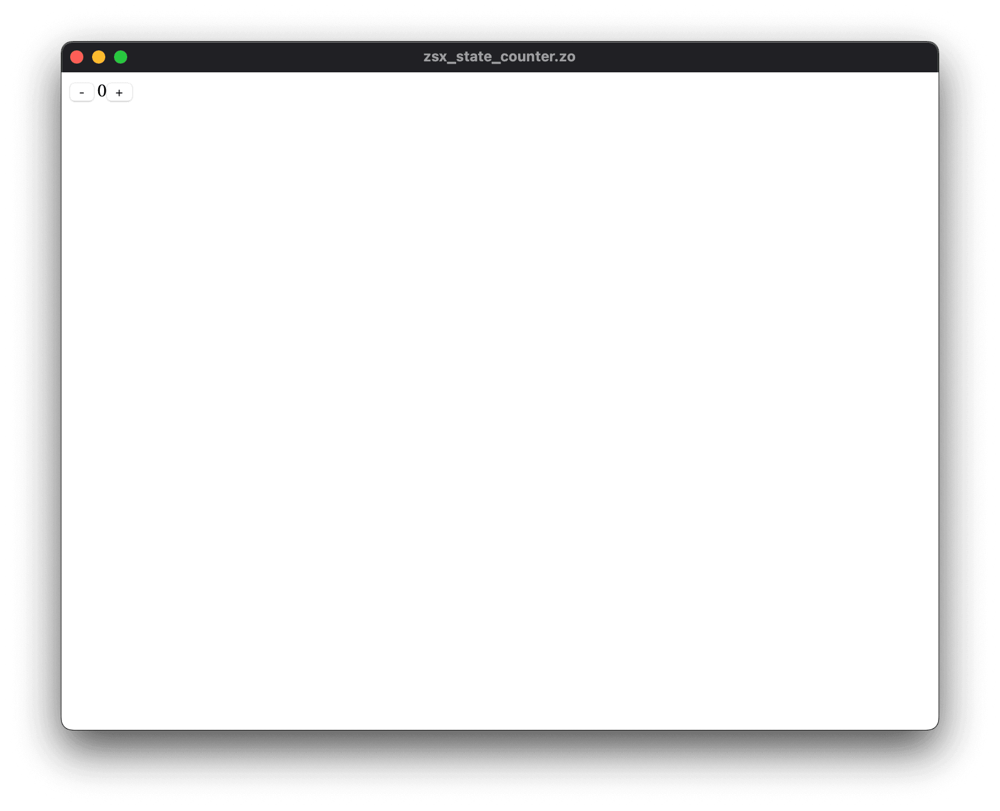
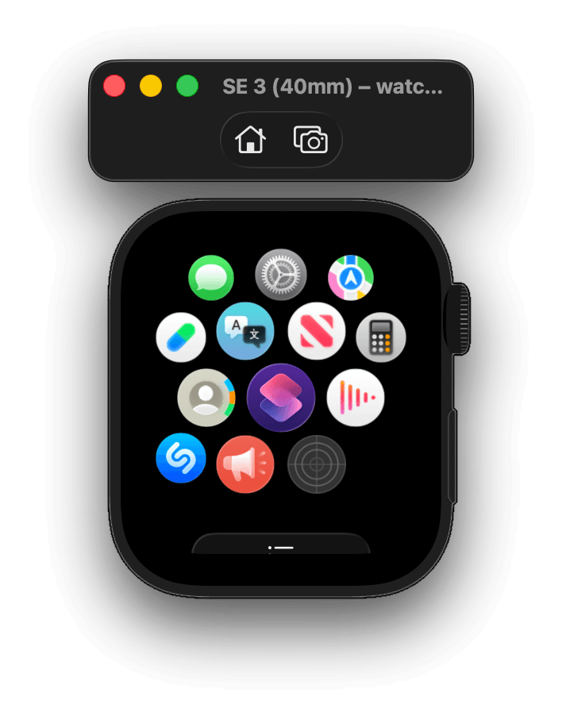
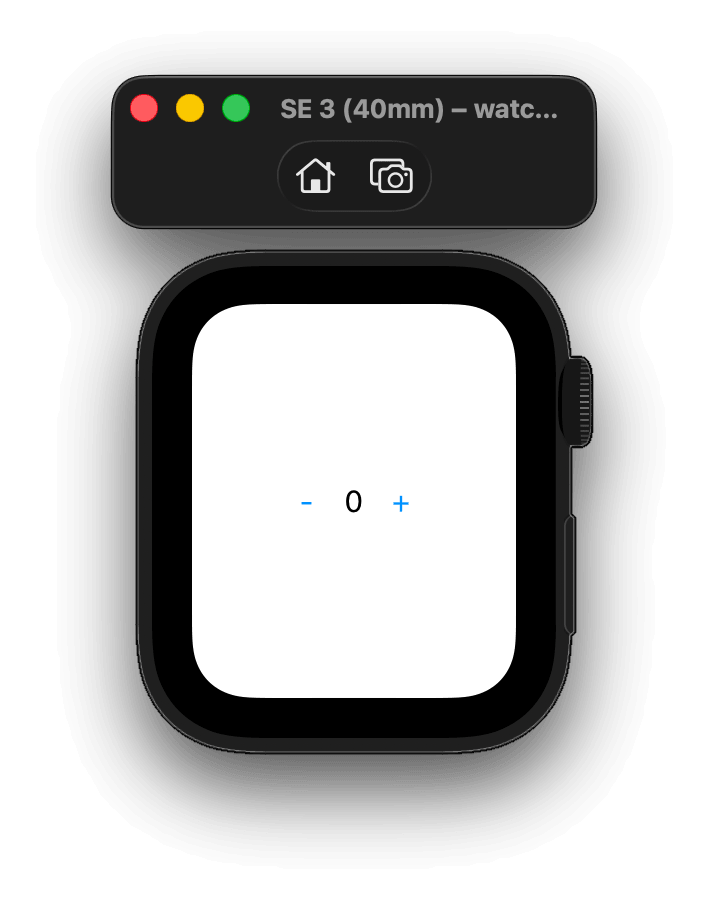
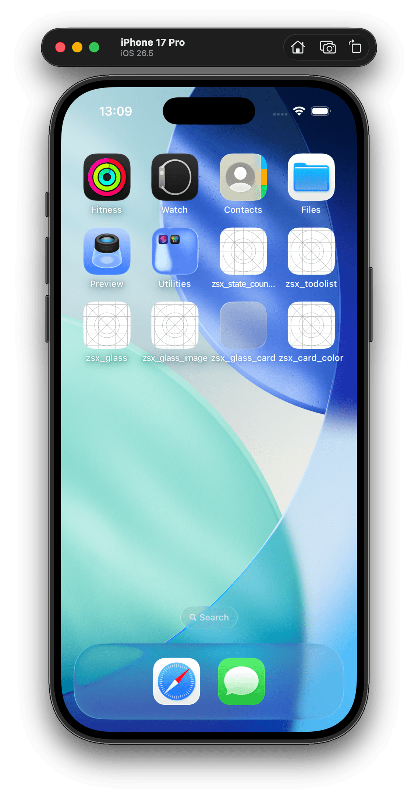
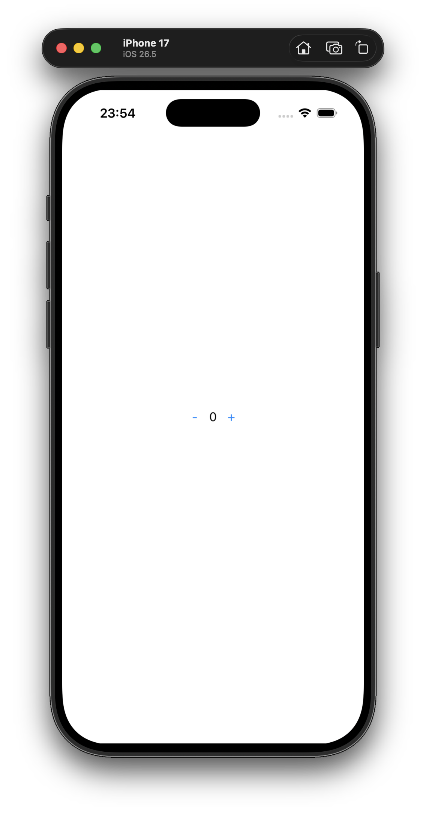

# zo.

  ```
  [zo] lines processed (including blank lines and comments) — 499998.
  │
  ├── "Why accept slow compilers? Just make them faster." — Jonathan Blow
  │
  ├── ✓ [zo@front-end] time — 301.591 ms (42.5%).
  │   ├── ⏺ [zo@tokenizer] time — 57.064 ms (8.0%).
  │   │   └── ⏺ processed — 2399990 tokens.
  │   ├── ⏺ [zo@parser] time — 36.126 ms (5.1%).
  │   │   └── ⏺ parsed — 2350646 nodes.
  │   └── ⏺ [zo@analyzer] time — 208.401 ms (29.3%).
  │       └── ⏺ annotated — 349996 nodes.
  ├── ✓ [zo@back-end] time — 408.614 ms (57.5%).
  │   ├── ⏺ [zo@codegen:arm64-apple-darwin] time — 391.537 ms (55.1%).
  │   │   └── ⏺ generated — 1 artifacts.
  │   └── ⏺ [zo@linker] time — 17.076 ms (2.4%).
  │       └── ⏺ linked — 1 files.
  └── ✓ [zo@total] time — 710.205 ms (100.0%).

  ⚡ speed: 704.02K LoC/s.
  ```

[](https://github.com/invisageable/zo)

[](https://github.com/invisageable/zo/actions)
[](https://discord.gg/JaNc4Nk5xw)
---

> *Turn your thoughts into type-safe software and Ui instantly.*

THE AiM OF THE PROJECT iS TO ENHANCE THE DEVELOPER EXPERiENCE, MAKiNG iT SEAMLESS TO BUiLD SOFTWARE THAT REFLECTS YOUR CREATiViTY. WE FOCUS ON DETAiLS THAT MATTER, WHERE TRANSFORMiNG YOUR THOUGHTS iNTO PROGRAMS iS NOT JUST EASY, BUT ENJOYABLE.

zo (pronounced `/zuː/` just like "zoo") iS A SiMPLE, LiGHTWEiGHT, CROSS-PLATFORM, GENERAL-PURPOSE PROGRAMMiNG LANGUAGE. TO SHiP, RUN AND BUiLD DESKTOP, MOBiLE AND WEB APPLiCATiONS WiTH ONE CODE SOURCE. THE CORE LiBRARY iNCLUDES SEVERAL PACKAGES. PROViDERS ARE AVAiLABLE TO EXPAND THE LANGUAGE's CAPABiLiTiES.

**JOiN THE DEVOLUTiON.**

[home](https://zo.compilords.house) — [initiation](https://zo.compilords.house/initiation) — [news](https://zo.compilords.house/news) — [discord](https://discord.gg/JaNc4Nk5xw)

## usage.

**-zsx-counter**

THiS PROGRAM DECLARES A COMPONENT (`counter`) COMPOSED BY TWO BUTTONS (`<button>`) AND A TEXT-BiNDiNG (`{count}`) ASSiGN TO `0`. EACH BUTTONS CONTAiNS AN EVENT (`@click`), ON CLiCK, iT TRiGGERS AND EXECUTE AN ACTiON TO DECREASE OR iNCREASE THE `count` VALUE. iT THEN RENDERS THE COMPONENT ViA A DiRECTiVE (`#render`).

  ```zo
  fun main() {
    mut count: int = 0;

    imu counter: </> ::= <>
      <button @click={fn() => count -= 1}>-</button>
      {count}
      <button @click={fn() => count += 1}>+</button>
    </>;

    #render counter;
  }
  ```

ONE LANGUAGE. ONE COMPiLER. ONE BiNARY. ONE WiNDOW. ALL PLATFORMS — SAME SOURCE.

---

<p align="center">
  
  
  
  
  
  
  
  
</p>

---

TESTiNG MACHiNE:

```
Operating System  — Darwin 26.5.1 (ARM64)
Kernel Version    — 25.5.0
CPU               — Apple M3 Pro (12 cores)
Total Memory      — 18.0 GB
Available Memory  — 9.4 GB
```

> *Work in progress. zo supports desktop (ARM64), MacOS (iOS, visionOS, tvOS, watchOS), web (bundled or webview). We plan to supports more — desktop (Linux, Windows) and mobile (Android). Styling is not already unified between all platforms for now.*

## why zo?

zo iS A STATiCALLY COMPiLED SYSTEMS LANGUAGE, WiTHOUT A ViRTUAL MACHiNE OR GARBAGE COLLECTOR. THE LANGUAGE PAiRS CONCURRENT, GREEN-THREADED EXECUTiON WiTH A SiNGLE, DECLARATiVE CODEBASE THAT DEPLOYS DiRECTLY TO NATiVE PLATFORM WiDGETS ACROSS DESKTOP, MOBiLE AND WEB.

CROSS-PLATFORM DEVELOPMENT REQUiRES COMPROMiSE: MANAGiNG UNSTABLE, GENERATED gradle AND xcode CONFiGURATiONS, OR CHOOSiNG BETWEEN javascript BRiDGE LATENCY AND CUSTOM CANVAS RENDERERS NON-NATiVE SCROLLiNG, BROKEN TEXT RENDERiNG, AND iNACCESSiBLE SCREENS.

zo RESOLVES THESE COMPROMiSES BY COMPiLiNG A SiNGLE, DECLARATiVE CODEBASE TO THE PLATFORM OF YOUR CHOiCE. iTS A SiMPLE AND EXPRESSiVE PROGRAMMiNG LANGUAGE FOR LOW-LEVEL AND HiGH-LEVEL.

> *« Rust makes you wait. C makes you think. zo just lets you build. » —i10e*

<!-- ## features. -->

**UNiFiED**

WRiTE Ui ONCE WiTH zsx — TARGET DESKTOP <sup>GPU</sup> MOBiLE <sup>native</sup> OR THE WEB <sup>DOM</sup>

**FAST**

iNSTANT FEEDBACK LOOP — QUiCK BUiLD TiME, RAPiD DEBUGGiNG <sup>HELPFUL ERROR MESSAGES</sup>

**SAFE**

STATiCALLY & STRONGLY TYPED — SAFE RUNTiME <sup>NO LEAKED THREADS, NO DATA RACES, NO USE AFTER FREE</sup>

**iNTEGRATED**

COMPLETE WORKSTATiON WiTH BUiLT-iN TOOLS — PACKAGE MANAGER <sup><a href="./crates/packager/fret">fret</a></sup> AND TEXT EDiTOR <sup>codelord</sup>

> *zo is in early development and not ready for production yet.*
>
> *WARNiNG — regarding Ai usage, we are using Ai to build based on our architecture and specification (made by humans). The compiler currently covers over 1500 unit and integration tests.*

## ecosystem.

THiS MONO-REPO POWERS AN ECOSYSTEM OF CRATES:

> *More crates are coming. The architecture is modular and composable. Be gentle.*

**-sources**

| NAME                                               | DESCRiPTiON                                           |
| :------------------------------------------------- | :---------------------------------------------------- |
| [eazy](./sources/tweener/eazy)                     | THE HiGH-PERFORMANCE TWEENiNG & EASiNG FUNCTiONS KiT. |
| [swisskit](./sources/crafter/swisskit)             | THE SWiSS-ARMY-KNiFE KiT.                             |
| [tree-sitter-zo](./sources/crafter/tree-sitter-zo) | THE zo tree-sitter GRAMMAR.                           |

**-crates**

| NAME                                         | DESCRiPTiON                 |
| :------------------------------------------- | :-------------------------- |
| [fret](./crates/packager/fret)               | THE zo PACKAGE MANAGER.     |
| [fret-vscode](./crates/packager/fret-vscode) | THE fret VS CODE EXTENSiON. |
| [zo](./crates/compiler/zo)                   | THE zo COMPiLER.            |
| [zo-vscode](./crates/compiler/zo-vscode)     | THE zo VS CODE EXTENSiON.   |

**-gallery**

...

## benchmark.

| Compiler | Run 1    | Run 2    | Run 3    | Run 4    | Run 5    | Average      |
| :------- | :------- | :------- | :------- | :------- | :------- | :----------- |
| **zo**   | 25.01ms  | 12.09ms  | 11.53ms  | 10.46ms  | 9.08ms   | **13.63ms**  |
| clang    | 270.34ms | 76.76ms  | 81.65ms  | 66.49ms  | 61.47ms  | **111.34ms** |
| go       | 376.35ms | 131.52ms | 125.96ms | 143.16ms | 129.17ms | **181.23ms** |
| rustc    | 272.33ms | 164.42ms | 147.28ms | 170.54ms | 167.56ms | **184.42ms** |
| gleam    | 205.87ms | 206.04ms | 205.66ms | 205.48ms | 202.47ms | **205.11ms** |
| odin     | 422.94ms | 216.09ms | 219.56ms | 228.20ms | 230.74ms | **263.50ms** |

*Workload: 503 tasks in a ring (`threadring`). A token hops node-to-node `N` times compiled to native ARM64 binary (including Hindley-Milner type inference, monomorphization, type checking, constant folding, propagation, dead code elimination and link passes).*

  - @SEE — [@methodology-and-full-numbers](./crates/compiler/zo-benches)

> *« Insanely faster, Usain Bolt would be jealous. » —i2N*

## get started.

  1. RUN THE iNSTALLATiON SCRiPT:

  ```sh
  curl --proto '=https' --tlsv1.2 -sSf https://zo.compilords.house/install.sh | sh
  ```

  2. VERiFY:

  ```
  zo --version
  ```

  3. SUCCESSFULLY iT WiLL DiSPLAY:

  ```
  zo x.x.x
  ```

ET VOiLÀ! NOW YOU CAN START THE [@initiation](https://zo.compilords.house/initiation) — THE EASiEST WAY TO GET THE BASiCS OF zo. ANY iSSUES? CHECK THE iNSTALLATiON GUiDE:

  - @SEE — [`01-install`](./crates/compiler/zo-notes/public/guidelines/01-install.md)

## sponsors & supports.

STARS, DONATiONS AND SPONSORS ARE WELCOME. SPREAD THE WORD e-ve-ry-where.

iF THiS PROJECT RESONATES WiTH YOU — PLEASE STAR iT. iT HELPS US GROW, ATTRACTS CONTRiBUTORS, AND VALiDATES THE DiRECTiON.

## credits.

THANKS TO:

[@ledruidd](https://github.com/ledruidd) [@SiegfriedEhret](https://github.com/SiegfriedEhret) [@akimd](https://github.com/akimd) [@graydon](https://github.com/graydon) [@rvirding](https://github.com/rvirding) [@worrydream](https://x.com/worrydream) [@j_blow](https://www.twitch.tv/j_blow) [@tsoding](https://x.com/tsoding) [@geohot](https://github.com/geohot) [@mike_acton](https://x.com/mike_acton)

> *« Merci à vous pour le turfu. TRiLU ! » — i10e*

## license.

[apache](./LICENSE-APACHE) — [mit](./LICENSE-MIT)

COPYRiGHT© **29** JULY **2024** — *PRESENT, [@invisageable](https://twitter.com/invisageable) ([@compilords](https://twitter.com/compilords)).*
