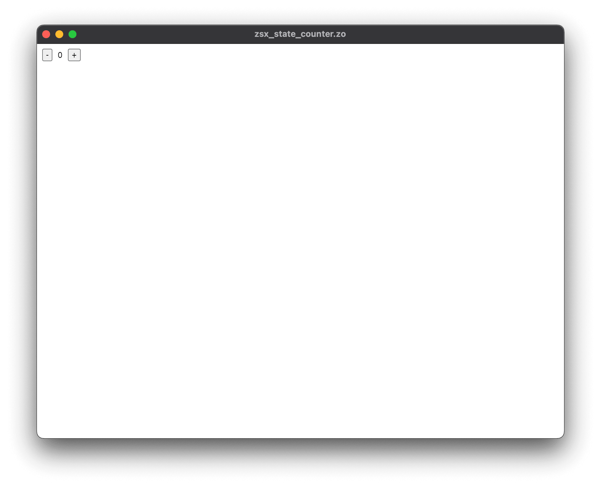

# zo.

[](https://github.com/invisageable/zo)

[](https://github.com/invisageable/zo/actions)
[](https://discord.gg/JaNc4Nk5xw)
---

> *Turn your thoughts into type-safe software and Ui instantly.*

[home](https://github.com/invisageable/zo) — [install](#get-started) — [how-to](./crates/compiler/zo-how-to) — [tests](./crates/compiler/zo-tests) — [benches](./crates/compiler/zo-benches) — [license](#license)

[https://zo.compilords.house](https://zo.compilords.house)

## usage.

**-zsx-counter**

  ```zo
  fun main() {
    mut count: int = 0;

    imu counter: </> ::= <>
      <button @click={fn() => count -= 1}>-</button>
      {count}
      <button @click={fn() => count += 1}>+</button>
    </>;

    #dom counter;
  }
  ```

<p align="center">
  
  
</p>

ONE LANGUAGE. ONE COMPiLER. ONE BiNARY. ONE WiNDOW. NATiVE GPU OR THE WEB — SAME SOURCE.

**-concurrency**

  ```zo
  fun producer_a(tx: Tx<int>) { tx.send(10); }
  fun producer_b(tx: Tx<int>) { tx.send(20); }                                   
                                                                                  
  fun main() {                                                                   
    nursery {                                                                    
      imu (tx1, rx1) := channel(1);
      imu (tx2, rx2) := channel(1);                                              
    
      spawn producer_a(tx1);                                                     
      spawn producer_b(tx2);
                                                                                  
      select {    
        rx1 => fn(value: int) => showln("chan1: {value}"),
        rx2 => fn(value: int) => showln("chan2: {value}"),                       
      }
    }                                                                            
  }
  ```

SUCCESFULLY BUiLD AN EXECUTABLE AND DiSPLAY A CLEAR OUTPUT ABOUT THE COMPiLATiON PROCESS:

  ```
  [zo] lines processed (including blank lines and comments) — 31.
  │
  ├── "Why accept slow compilers? Just make them faster." — Jonathan Blow
  │
  ├── ✓ [zo@front-end] time — 767.792 μs (19.8%).
  │   ├── ⏺ [zo@tokenizer] time — 98.042 μs (2.5%).
  │   │   └── ⏺ processed — 120 tokens.
  │   ├── ⏺ [zo@parser] time — 36.625 μs (0.9%).
  │   │   └── ⏺ parsed — 772 nodes.
  │   └── ⏺ [zo@analyzer] time — 633.125 μs (16.3%).
  │       └── ⏺ annotated — 8 nodes.
  ├── ✓ [zo@back-end] time — 3.106 ms (80.2%).
  │   ├── ⏺ [zo@codegen:arm64-apple-darwin] time — 1.332 ms (34.4%).
  │   │   └── ⏺ generated — 1 artifacts.
  │   └── ⏺ [zo@linker] time — 1.774 ms (45.8%).
  │       └── ⏺ linked — 1 files.
  └── ✓ [zo@total] time — 3.874 ms (100.0%).

  ⚡ speed: 8.00K LoC/s.

  chan1: 10
  ```

## why zo?

zo iS BUiLT FROM THE GROUND UP USiNG DATA-ORiENTED DESiGN. BY HAND-ROLLiNG THE COMPiLER STAGES AND EMiTTiNG MACHiNE CODE DiRECTLY, zo ELiMiNATES THE OVERHEAD OF HEAVY ABSTRACTiONS AND EXTERNAL LiNKERS.

> *« Rust makes you wait. C makes you think. zo just lets you build. » — i10e*

### benchmarks.

| Compiler  | Hot Average | Throughput      | vs zo             |
| :-------- | :---------- | :-------------- | :---------------- |
| **zo**    | **60 ms**   | **~167K LoC/s** | **1x (baseline)** |
| **clang** | 148 ms      | ~67K LoC/s      | 2.4x slower       |
| **rustc** | 321 ms      | ~31K LoC/s      | 5.3x slower       |

*Workload: 10,000 lines of code compiled to native ARM64 binary (including Hindley-Milner type inference, monomorphization, type checking, constant folding, propagation, dead code elimination and link passes). No parallelization (for now).*

[@methodology-and-full-numbers](./crates/compiler/zo-benches)

### our pipeline.

iN THOSE 60 MiLLiSECONDS, THE COMPiLER PERFORMS THE FOLLOWiNG PHASES SEQUENTiALLY:

  1. TOKENiZiNG — *Processes raw text into tokens.*
  2. PARSiNG — *Builds the parse tree.*
  3. ANALYZiNG — *Performs Hindley-Milner type inference, monomorphization, and type checking.*
  4. OPTiMiZiNG — *Executes algebraic optimizations (constant folding, propagation, dce).*
  5. CODEGEN & LiNK — *Emits direct machine code and creates the final binary.*

> *« Insanely faster, Usain Bolt would be jealous. » — i2N*

## features.

  - **UNiFiED**: WRiTE Ui ONCE WiTH zsx — TARGET NATiVE <sup>GPU</sup> OR THE WEB <sup>DOM</sup>.
  - **FAST**: BUiLT FROM SCRATCH USiNG MODERN COMPiLER TECHNiQUES FOR iNSTANT EXECUTiON AND RAPiD DEBUGGiNG WiTH HELPFUL ERROR MESSAGES.
  - **SAFE**: STATiCALLY & STRONGLY TYPED — USES GREEN AND OS THREADS WRAPPED iN NURSERY TASK SCOPES. <sup>NO LEAKED THREADS, NO DATA RACES</sup>.
  - **iNTEGRATED**: A COMPLETE WORKSTATiON WiTH BUiLT-iN TOOLS — PACKAGE MANAGER <sup><a href="./crates/packager/fret">fret</a></sup> AND TEXT EDiTOR <sup>codelord</sup>.

## get started.

  1. RUN THE iNSTALLATiON SCRiPT:

  ```sh
  curl --proto '=https' --tlsv1.2 -sSf https://zo.compilords.house/install.sh | sh
  ```

  2. VERiFY:

  ```
  zo --version
  ```

  3. SUCCESSFULLY iT WiLL DiSPLAY:

  ```
  zo x.x.x
  ```

> *Note: zo is entirely self-contained. It requires no heavy external frameworks.*

  1. ET VOiLÀ! NOW YOU CAN START THE [@initiation](https://zo.compilords.house/initiation) — THE EASiEST WAY TO GET THE BASiCS OF zo.

ANY iSSUES? CHECK THE iNSTALLATiON GUiDE:

  - @SEE — [`01-install`](./crates/compiler/zo-notes/public/guidelines/01-install.md)

## ecosystem.

THiS MONO-REPO POWERS AN ECOSYSTEM OF CRATES:

**-sources**

| NAME                                               | DESCRiPTiON                                           |
| :------------------------------------------------- | :---------------------------------------------------- |
| [eazy](./sources/tweener/eazy)                     | THE HiGH-PERFORMANCE TWEENiNG & EASiNG FUNCTiONS KiT. |
| [swisskit](./sources/crafter/swisskit)             | THE SWiSS-ARMY-KNiFE KiT.                             |
| [tree-sitter-zo](./sources/crafter/tree-sitter-zo) | THE zo tree-sitter GRAMMAR.                           |

**-crates**

| NAME                                         | DESCRiPTiON                 |
| :------------------------------------------- | :-------------------------- |
| [fret](./crates/packager/fret)               | THE zo PACKAGE MANAGER.     |
| [fret-vscode](./crates/packager/fret-vscode) | THE fret VS CODE EXTENSiON. |
| [zo](./crates/compiler/zo)                   | THE zo COMPiLER.            |
| [zo-vscode](./crates/compiler/zo-vscode)     | THE zo VS CODE EXTENSiON.   |

> *More crates are coming. The architecture is modular and composable. Be gentle.*

## the manifesto.

zo iS A COMPiLER OF A COMPiLER iNSiDE ANOTHER GiANT COMPiLER THAT iS iTSELF iNSiDE A GiGANTiC COMPiLER.

THE AiM OF THE PROJECT iS TO ENHANCE THE DEVELOPER EXPERiENCE, MAKiNG iT SEAMLESS TO BUiLD SOFTWARE THAT REFLECTS YOUR CREATiViTY. WE FOCUS ON DETAiLS THAT MATTER, OPENiNG NEW DiMENSiONS iN THE SOFTWARE UNiVERSE WHERE TRANSFORMiNG YOUR THOUGHTS iNTO PROGRAMS iS NOT JUST EASY, BUT ENJOYABLE.

zo iS A COMPLETE ECOSYSTEM THAT GiVES YOU THE KEYS. YOU FiNALLY HAVE CONTROL OVER YOUR WORKSTATiON. YOU'LL NEVER HAVE TO WORK BLiND AGAiN. OUR TOOLS PROViDE ALL THE iNFORMATiON YOU NEED FOR YOUR PROGRAM, FROM DESiGN TO DELiVERY.

WE ARE AGAiNST ABUNDANT SOFTWARE UNiFORMiTY. zo UNiFiES THE WEB AND THE GPU — NOT BY FORCiNG THE WEB iNTO A CANVAS, BUT BY HARMONiZiNG FLEXBOX LAYOUTS WiTH RAW GPU POWER. WE WiLL DO EVERYTHiNG WE CAN TO PUSH THE BOUNDARiES OF iNNOVATiON TO THE LiMiT.

**JOiN THE DEVOLUTiON.**

## contributing.

WE LOVE CONTRiBUTORS. THiS iS A PLAYGROUND FOR COMPiLER __NERDS__, FRONTEND __HACKERS__, AND __CREATIVES__.

OPEN AN iSSUE, OR COME SAY HELLO ON [discord](https://discord.gg/JaNc4Nk5xw). YOU CAN ALSO CONTACT US AT `echo -n 'dGhlQGNvbXBpbG9yZHMuaG91c2U=' | base64 --decode`.    

OPEN A [DiSCUSSiON](https://github.com/invisageable/zo/discussions), iF YOU NEED MORE iNFO.

## sponsors & supports.

STARS, DONATiONS AND SPONSORS ARE WELCOME. SPREAD THE WORD e-ve-ry-where.

iF THiS PROJECT RESONATES WiTH YOU — PLEASE STAR iT. iT HELPS US GROW, ATTRACTS CONTRiBUTORS, AND VALiDATES THE DiRECTiON.

## credits.

THANKS TO:

[@ledruidd](https://github.com/ledruidd) [@SiegfriedEhret](https://github.com/SiegfriedEhret) [@akimd](https://github.com/akimd) [@graydon](https://github.com/graydon) [@rvirding](https://github.com/rvirding) [@worrydream](https://x.com/worrydream) [@j_blow](https://www.twitch.tv/j_blow) [@tsoding](https://x.com/tsoding) [@geohot](https://github.com/geohot) [@mike_acton](https://x.com/mike_acton)

> *« Merci à vous pour l'inspiration. TRiLU ! » — i10e*

## license.

[apache](./LICENSE-APACHE) — [mit](./LICENSE-MIT)

COPYRiGHT© **29** JULY **2024** — *PRESENT, [@invisageable](https://twitter.com/invisageable) — [@compilords](https://twitter.com/compilords) team.*
