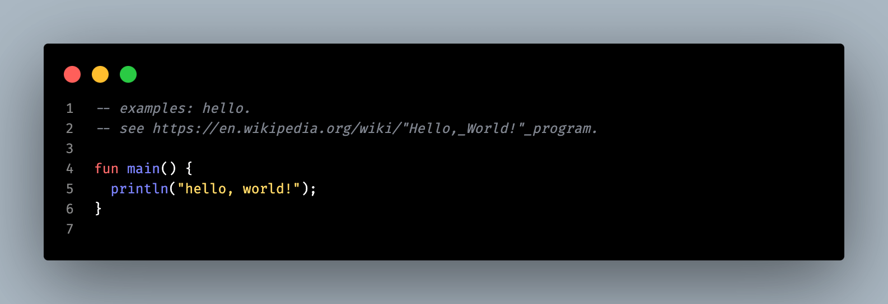
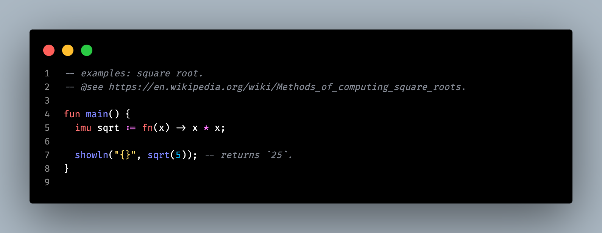
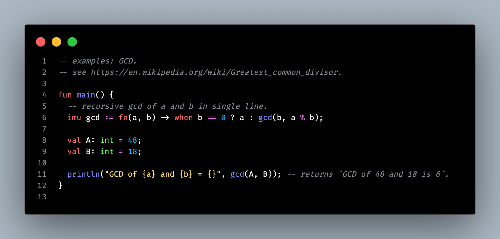
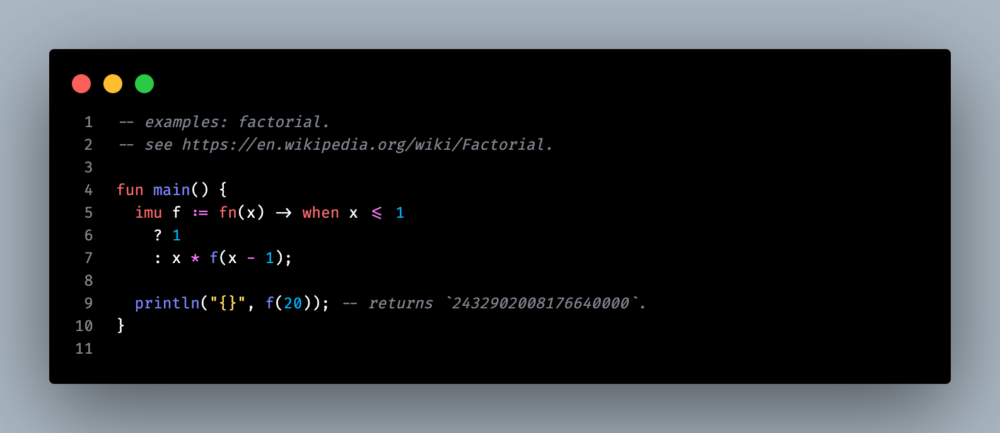
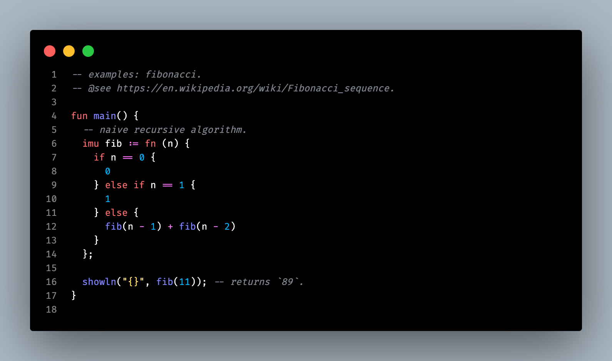
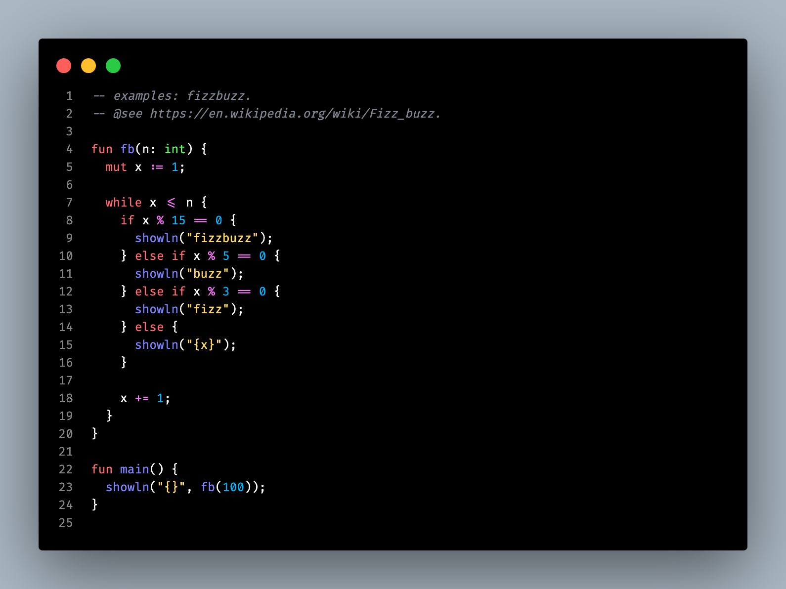

# zo.

> *Codify human thoughts into energy-efficient, sane and reliable cross-platform software.*

## about.

zo is tiny, simple, fast and elegant for creating meticulously optimized software.    

zo is focusing on creativity, wasm and performance.

## goals.

- [ ] fast `compilation-time`.
- [ ] user-friendly `error` messages.
- [ ] meta-language.
- [ ] statically-typed.
- [ ] robust `type system` — *hindley-milner algorithm.*.
- [ ] safe concurrency model — *Actor Model Erlang-like.*
- [ ] powerfull `tools` — *native REPL, code editor, etc.*

## compiler phases.

- `reading` — *read the input and generates the source code as bytes.*
- `tokenizing` — *transforms a sequence of bytes into a list of tokens.*
- `parsing` — *creates an abtract syntax tree from a list of tokens.*
- `analyzing` — *analyses the semantics of a given AST.*
- `codegen` — *generates the code for a specific target.*
- `interpreting` — *interprets a given AST.*
- `building` — *builds the related files based on the target.*

## dirmap.

```
|-- zo                  # The entry point of the compiler.
|-- zo-analyzer         # The semantic analysis phase of the compiler.
|-- zo-ast              # The `zo` abstract syntax tree.
|-- zo-builder          # The builder — used to build the ouput machine code.
|-- zo-codegen          # The code generation phase of the compiler.
|-- zo-codegen-llvm     # The LLVM code generation phase of the compiler.
|-- zo-codegen-py       # The Python code generation phase of the compiler.
|-- zo-codegen-wasm     # The WASM code generation phase of the compiler.
|-- zo-compiler         # The `zo` compiler.
|-- zo-driver           # The command-line interface of the compiler.
|-- zo-inferencer       # The type system.
|-- zo-interner         # The string interner.
|-- zo-interpreter      # The evaluation phase of the compiler.
|-- zo-interpreter-clif # The Cranelift evaluation phase of the compiler.
|-- zo-interpreter-zo   # The `zo` evaluation phase of the compiler.
|-- zo-notes            # Docs, notes and speeches.
|-- zo-parser           # The syntax analysis of the compiler.
|-- zo-reader           # The reader — used to read the input source code.
|-- zo-reporter         # The reporter — used to generates user-friendly error messages.
|-- zo-samples          # Samples of the `zo` programming language.
|-- zo-session          # The global session of the compiler.
|-- zo-tokenizer        # The lexical analysis of the compiler.
|-- zo-ty               # The types of the `zo` programming language.
|-- zo-value            # Values are used by the `zo` evaluation phase.
```

## examples.

**[-hello](./zo-samples/examples/hello.zo)**

THE SUPERSTAR [`hello, world!`](https://en.wikipedia.org/wiki/%22Hello,_World!%22_program) — *PRiNTS `hello, world!`.*



**[-square-root](./zo-samples/examples/square-root.zo)**

THE ELEGANT [Square root](https://en.wikipedia.org/wiki/Square_root) — *PRiNTS THE SQUARE ROOT OF `5`.*



**[-greatest-common-root](./zo-samples/examples/greatest-common-root.zo)**

THE RECURSiVE [GCD](https://en.wikipedia.org/wiki/Greatest_common_divisor) — *PRiNTS THE GREATEST COMMON DiViSOR OF `48` AND `18`.*



**[-factorial](./zo-samples/examples/factorial.zo)**

THE SMOOTH [factorial](https://en.wikipedia.org/wiki/Square_root) CRiMiNAL — *PRiNTS THE FACTORiAL OF `20`.*



**[-fibonacci](./zo-samples/examples/fibonacci.zo)**

SiR [Fibonacci](https://en.wikipedia.org/wiki/Fibonacci_sequence) — *PRiNTS THE `11` RANK iN THE FiBONACCi SEQUENCE.*



**[-fizzbuzz](./zo-samples/examples/fizzbuzz.zo)**

THE RECREATiONAL [Fizz Buzz](https://en.wikipedia.org/wiki/Fizz_buzz) GAME — *PRiNTS THE iNTEGERS FROM `1` TO `100`, THEN FOR EVERY MULTiPLE OF `3`, WRiTE `"Fizz"`, AND FOR EVERY MULTiPLE OF `5`, iT PRiNTS `"Buzz"`. FOR NUMBERS WHiCH ARE MULTiPLES OF BOTH `3` AND `5`, iT SHOULD PRiNTS `"FizzBuzz"`; FOR EVERY OTHER NUMBER, iT SHOULD PRiNT THE NUMBER UNCHANGED.*


