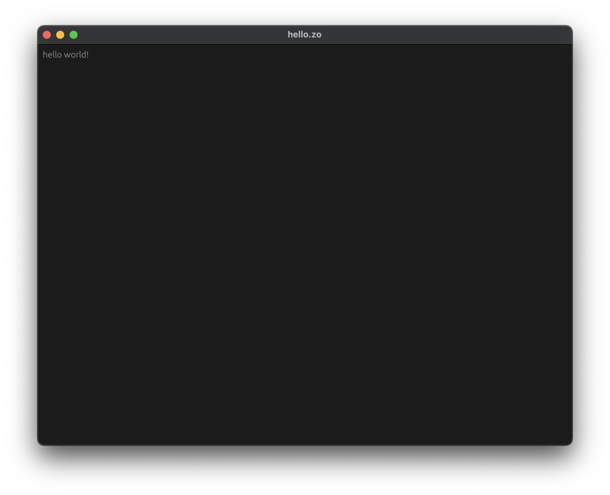
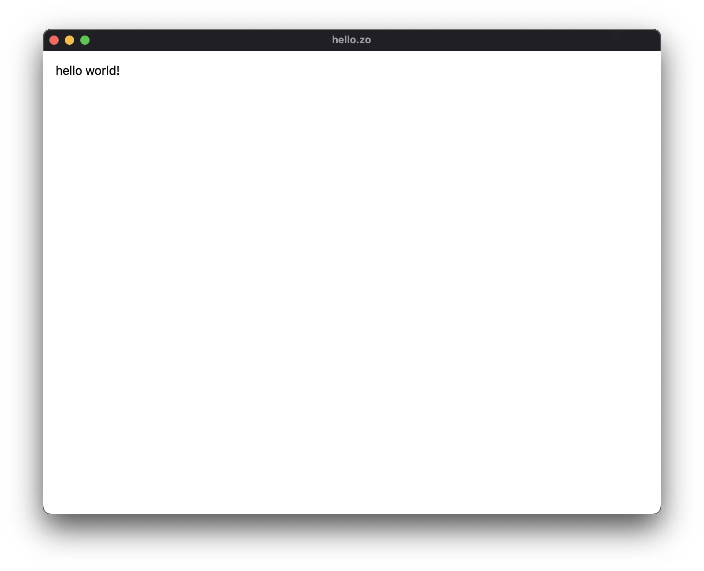

# crates — compiler.

> *the zo ecosystem crates.*

## about.

- @SEE: [zo](../compiler/zo)

## commands.

**-programming-mode**

`build` YOUR PROGRAM AS AN EXECUTABLE. GO TO `crates/compiler/zo-tests/programming` AND RUN:

  ```sh
  zo -- build hello.zo -o hello
  ```

> *It will creates an executable named `hello` in the current folder.*

THEN, YOU CAN RUN iT:

  ```sh
  ./hello
  ```

iT WiLL PRiNTS:

  ```
  hello, world!
  ```

**-templating-mode**

  `run` YOUR PROGRAM iN A NATiVE WiNDOW<sup>`winit`</sup> OR A LiGHTWEiGHT WEBViEW<sup>`wry`</sup> DEPENDiNG OF THE TARGET. `crates/compiler/zo-tests/templating` AND RUN:

  ```sh
  zo -- run zsx-hello.zo
  ```

THAT'S iT, YOU SHOULD SEE A NATiVE APP ON YOUR SCREEN.

> *This command is only for `native` app, if you want to build for `web` you should add the `--web` flag.*

<p align="center">
  
  
</p>

## dev.

FOR AN iNTRODUCTiON, [HERE](./zo-notes/public/guidelines/02-install.md) iS WHERE iT STARTS.

## architecture.

...

## release.

THE zo ECOSYSTEM iNCLUDES zo AND fret, TO RELEASE A NEW VERSiON, WE DO THE FOLLOWiNG.

  1. BUMP ALL VERSiONS:

  ```sh
  just bump patch
  ```
  
  2. VERiFY THE BUMP CORRECTNESS:

  ```sh
  just list_versions
  just pre-commit
  ```

  3. THEN COMMiT AND TAG:

  ```sh
  git add -A
  git commit -m "ops(zo): release: `0.1.1`"
  ```

  > *Here is our git naming-convention [guidelines](./zo-notes/public/guidelines/01-introduction.md#git-naming-convention).*

  4. FiNALLY, CREATE THE TAG AND PUSH EVERYTHiNG:

  ```sh
  just release 0.1.1
  ```
