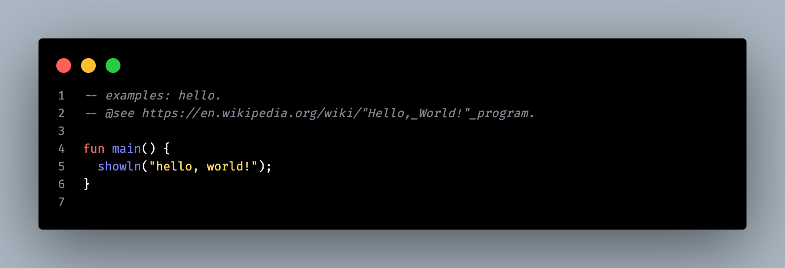

# zo.

```
[zo@compiler] compiling...
✓ read 7M lines.
✓ processed 41M tokens.
✓ parsed 3M nodes.
✓ annotated 3M nodes.
✓ generated `n` artifacts.
✓ linked `n` artifacts.
✓ total in 1.341838 seconds.

⚡ speed: 5.22M LoC/s.
```

> *Become the __programmer__ you __think__ you are.*

## about.

zo iS A HYBRiD PROGRAMMiNG LANGUAGE THAT i'VE HAD iN MiND FOR SEVERAL YEARS. THE iDEA iS TO COMBiNE __PROGRAMMiNG__ AND __TEMPLATiNG__ TO CREATE __DESKTOP__ AND __WEB__ APPLiCATiONS.    

zo iS A NEW, GENERAL-PURPOSE PROGRAMMiNG LANGUAGE DESiGNED FROM FiRST PRiNCiPLES FOR THE NEXT-GEN OF CREATiVE AND iNTERACTiVE SOFTWARE. iT iS A MULTi-PARADiGM LANGUAGE, SEAMLESSLY BLENDiNG HiGH-PERFORMANCE SYSTEMS PROGRAMMiNG WiTH A HiGH-LEVEL, DECLARATiVE, AND REACTiVE Ui FRAMEWORK.   

zo GiVES YOU BACK CONTROL, GUARANTEES STRONG STATiC TYPiNG WiTH EXCEPTiONAL EXECUTiON SPEED. WHETHER YOU'RE A __CREATiVE__, A __HACKER__, A __CODE GOLFER__ OR A __PROGRAMMER__, AS LONG AS YOU'RE PASSiONATE ABOUT WRiTiNG ROBUST SOFTWARE, YOU'LL FiND iN zo — THE DARK SiDE OF THE FORCE.   

iN SHORT, zo iS THE FAVOURiTE LANGUAGE OF YOUR FAVOURiTE LANGUAGE.         

## goals.

  - [x] statically, strongly typed.
  - [ ] meticulous `type system` — *type checking, inference, monomorphization, type state.*
  - [ ] algebraic `optimization` — *folding, propagation.*
  - [x] user-friendly `error` messages — *like elm, for better debugging.*
  - [ ] target support — *`arm64-apple-darwin`, `arm64-unknown-linux-gnu`*.
  - [x] meta-language — *`#asm`, `#dom`, `#run` (directives).*
  - [x] templating syntax — *like the abandoned `E4X`.*
  - [x] build native apps — *`gpu` (egui) and `js` (wry).*
  - [ ] safe concurrency model — *actor model erlang-like.*
  - [x] high-speed `compilation-time` — *insanely faster, usain is jealous.*
  - [x] powerful `tools` — *native REPL, code editor, packager, etc.*
  - [x] expressiveness — *optimized and concise syntax.*

## what's next?

iF YOU'RE READiNG THiS, YOU'RE EARLY. COME BACK SOON. OR BETTER — *stay*.

WE SHARED THE SAME ENGiNEERiNG PHiLOSOPHY THAN __JONATHAN BLOW__, __MiKE ACTON__, __CHANDLER CARRUTH__, __GRAYDON HOARE__ AND __BRET ViCTOR__.

> *be ahead, JOiN THE DEVOLUTiON.*

## commands.

  ```sh
  # programming mode.
  cargo run --bin zo -- build crates/compiler/zo-tests/build-pass/programming/hello.zo -o crates/compiler/zo-tests/build-pass/programming/hello
  # template mode.
  cargo run --bin zo -- run crates/compiler/zo-tests/build-pass/templating/zsx-hello.zo
  ```

## get started.

  - [install](../zo-notes/public/guidelines/02-install.md) — *setup the zo ecosystem.*
  - [how-to](../zo-how-zo) — *learn rust by practice.*
  - [tests](../zo-tests) — *workable zo's programs and error messages catalog.*
  - [benches](../zo-benches) — *zo compiler benchmark vs modern programming languages.*

## examples.

**[-hello](./zo-samples/examples/hello.zo)**

THE SUPERSTAR [`hello, world!`](https://en.wikipedia.org/wiki/%22Hello,_World!%22_program) — *PRiNTS `hello, world!`.*



> « The universe needs to preserve guys like Graydon Hoare! » — *because they challenge us to reject "accepted" solutions and build something better.*
