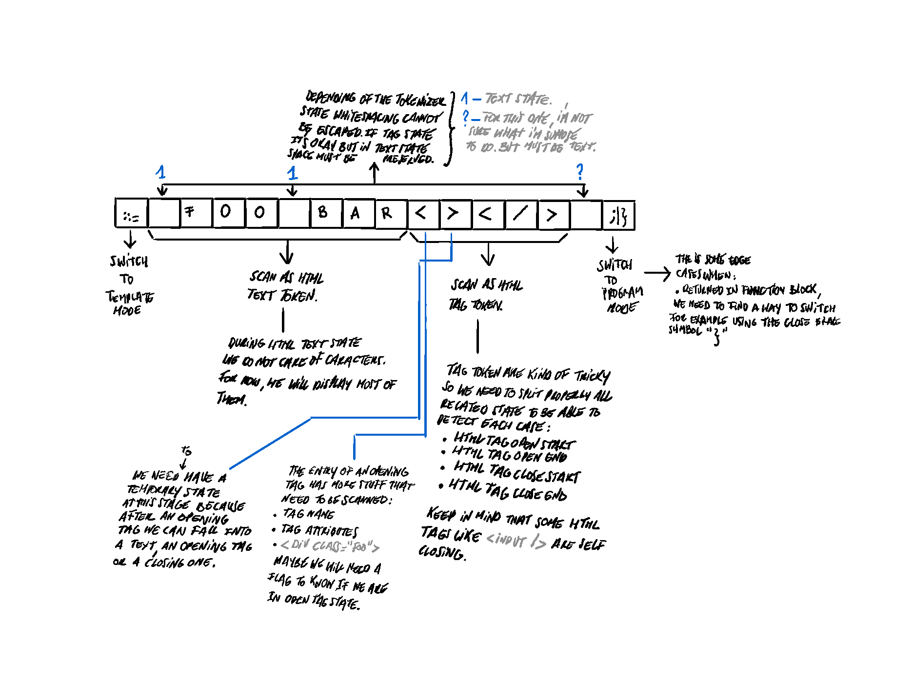

# S01E20 — 17-08-2024.

> *Une possible issue de secours.*

[prev](S01E19-16-08-2024.md) — [next](S01E21-18-08-2024.md)

## jour 20.

Je trouve qu'il est plus difficile de scanner et parser un langage de la famille XML type HTML ou JSX qu'un langage de programmation. Cette difficulté s'accentue lorsque l'on combine ces deux analyses au sein d'un langage de programmation. Hier, je t'ai révélé que je ne savais pas comment faire, que j'étais coincé et que mon POC n'était clairement pas la bonne approche à suivre. Autre contrainte, je ne voulais pas devoir recommencer de zéro l'écriture du `Tokenizer` et le `Parser`.    

Finalement, je pense être sur la bonne piste. Ce n'est surement pas la solution optimale en terme de performance. Mais au stade où j'en suis cela n'a aucune importance. Je m'occuperai des performances critiques à la fin. Une fois que j'aurai un compilateur relativement stable, il fera sens que je m'en occupe. Pour l'instant, je dois livrer un prototype qui fonctionne.    

Sinon si toi aussi, tu cherches à ajouter à ton langage une dimension, plus adapté pour le web. Voici ma méthode. Je rappelle que mon besoin est d'être capable d'analyser la syntaxe suivante :    


A savoir que sous le capot de mon `Tokenizer` se cache une sorte de machine à état. Ce qui devrait me faciliter l'ajout d'états complémentaires. Pour commencer, je dois ajouter à mon `Tokenizer` une nouvelle propriété `mode` qui contient une énumération :   

```rs
enum TokenizerMode {
  Program,
  Template,
}

pub struct Tokenizer {
  // ...
  mode: TokenizerMode,
}
```

Ce qui va lui donner la possibilité de changer de mode durant son analyse. Par défaut, le mode est `TokenizerMode::Program` — et lorsque le curseur aura scanner ce symbole `::=`, le `Tokenizer` va changer de mode pour passer en mode `TokenizerMode::Template`. À partir de là, le comportement du tokenizer est différent que celui du mode `Program`. Ensuite, je vais ajouter de nouveaux états à mon `Tokenizer` pour avoir une distinction claire sur les états spécifiques au mode `Program` et ceux spécifiques au mode `Template` :   

```rs
enum TokenizerState {
  // ...
  HtmlData,
  HtmlText,
  HtmlTagOpenStart,
  HtmlTagopenEnd,
  HtmlTagName,
  HtmlTagCloseStart,
  HtmlTagCloseEnd,
}
```

C'est l'idée donc à toi de définir les états nécessaires à ton besoin pour être capable d'analyser du HTML. Tu peux en avoir moins comme tu peux en avoir plus. Puis, ce n'est pas une vérité absolue. Je ne sais pas, si c'est la bonne approche, mais sur le papier théoriquement elle est réalisable. Tu trouveras surement une meilleure solution sur les Internets.

Ensuite, il va falloir que j'ai un nouveau type jetons :    

```rs
pub enum TokenKind {
  // ...
  Html(Html),
}

pub enum Html {
  Tag(Tag),
  Text(String),
}

// Tag must be an struct with a `kind` property of `TagKind`.
// Because we need more data such as the name of a tag, attributes
// and children.
pub enum Tag {
  Fragment,
  Open,
  Close,
  SelfClose,
}
```

Maintenant que tu as l'idée globale, il faut que l'on soit capable de rebasculer dans le mode `Program`. En fonction de ton langage, tu vas devoir penser à toutes les possibilités qui vont servir de marqueurs. Dans mon cas, pour l'instant, je n'en vois que deux :

1. `;` — dans le cas d'assignation de variable ou d'un retour de fonction via le mot clé `return`.

2. `}` — dans le cas de dernière instruction dans un bloc d'instruction.

- À voir, car vu qu'il y aura la possibilité d'injecter des expressions dynamiquement c-à-d `{foo}`. Il ne faut pas que `}` soit pris comme une fin d'analyse. Normalement, ça ne devrait pas être un souci. Je dois investiguer là-dessus au cas où.

C-à-d que lorsque le curseur va scanner un de ces deux symboles. Je dois lui dire de basculer en mode `Program`. Et c'est tout, avec ça, je suis capable d'avoir un contrôle plus précis sur le comportement du `Tokenizer`. Je te laisse mes notes, bon c'est en anglais et qui plus est, bourré de fautes, mais ça va te permettre de mieux visualiser comment se schématise l'analyse lexicale dans ma tête.



> Garde en tête qu'en fonction du mode, les caractères que tu dois scanner ne sont pas les mêmes. Par exemple ce symbole `<` en mode `Program` est un jeton de type `Punctuation` tandis qu'en mode `Template` il me sert de point d'ancrage pour détecter si je suis je dois analyser une balise ouverte ou fermée.    

[@invisageable](https://twitter.com/invisageable)   

---

[prev](S01E19-16-08-2024.md) — [next](S01E21-18-08-2024.md)   
