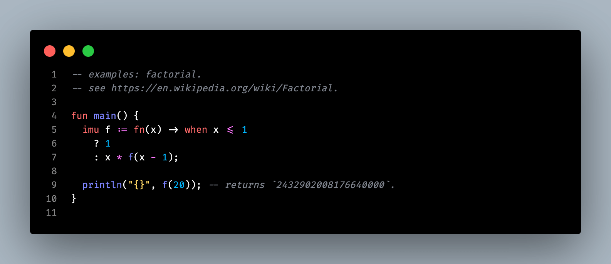

# S01E17 — 14-08-2024.

> *Cette bonnasse de syntaxe de l'espace.*

[prev](S01E16-13-08-2024.md) — [next](S01E18-15-08-2024.md)

## jour 17.

Palala ! Quelle satisfaction. Après avoir rajouter des exemples de programmes simples qui fonctionnent dans le `README` du [compilateur](../../crates/compiler). Je commence à entrevoir l'élégance de la syntaxe zo. J'ai une exigence à son paroxysme lorsqu'il s'agit de syntaxe. C'est d'ailleurs à cause de sa syntaxe horrible à mes yeux, que je n'ai pas continué le Go. Sa combinaison de convention de nommage n'est pas la bonne. Par exemple, un truc que je ne pige pas et qui me pique grave les yeux c'est d'utiliser la convention de nommage `PascalCase` pour le nom des fonctions, par contre cette convention n'est pas respectée pour la fonction `main` qui sert de point d'entrée au programme. Ça, c'est un langage qui a été codé dans l'urgence des exigences Google.    

De toute façon, `Google` s'en bats les ascii de la syntaxe. Regardes [Carbon](https://github.com/carbon-language/carbon-lang), j'ai la tête qui tourne dès que je vois leur syntaxe. Et ils ont beaux vouloir remplacer le C++ et avoir tout ce qui va bien sous le cabot. Peu m'en chaut. Je refuse de m'infliger tant de supplices. Les mecs ont les meilleurs cerveaux du monde, mais aucun n'a pensé de mettre un amoureux des lettres, mots, texte. Ils vont galérer pour concurrencer des langages comme Jai, ou Odin. Seul Dart s'en sort plus ou moins.   

Je suis conscient que tout le monde s'en balance de la syntaxe — certains me diront : "C'est ce que sait faire le langage qui compte !". D'accord, ok-ay... Cependant, pour du texte que je vais regarder et manipuler tous les jours, j'exige qu'il soit clair, beau et esthétique. Que ceux qui pensent le contraire aillent coder en Lisp. Avant tout, il faut prendre en compte que l'appréciation d'une syntaxe est subjective.    

Ce que j'attends d'une syntaxe dans langage qui se veut être dans le turfu. C'est avant tout une prise de risque. Lorsque tu vas t'intéresser à ce sujet, tu vas vite te rendre compte qu'il y a des limites, car tu dois t'assurer que la syntaxe que tu choisis soit non seulement facile à parser mais aussi intuitive pour l'utilisateur. Des langages comme Brainfuck, APL ou encore Haskell ont une barrière d'entrée plus haute qu'un langage comme JavaScript ou Python. Et là, je ne parle pas des concepts que les langages apportent. Je ne parle que de la syntaxe, le prix d'entrée peut parfois est trop cher pour donner envie à se lancer. Puisque n'oublie pas que plus tu vas avoir des utilisateurs capables de créer des programmes, mieux c'est, car tu gagnes en visibilité. Si un enfant peut bidouiller des programmes simples sans devoir attendre d'avoir 18 ans et d'être en école d'ingénieur en informatique, tu as tout gagné. Puisque le langage avec lequel il a grandit est le tient — je sous-entends celui avec une syntaxe adéquate. Son ADN respire ton langage, non pas celui avec la syntaxe qui donne envie de se tirer une balle dans la tête. En tant qu'ingénieur, on passe notre temps à lire du code, c'est pourquoi il faut qu'un langage est une syntaxe agréable pour l'oeil et la mécanique du cerveau. Puis d'autres limites entre en jeu comme les caractères ascii et les combinaisons possibles, les mots clés et la sémantique.   

Il y a un concept que j'ai toujours dans un coin de ma tête lorsaue je pense syntaxe c'est "Le code de la route". C'est tellement un travail d'orfévre que je ne m'en lasse pas de regarder tous les panneaux de signalisation des différents pays. Je t'en laisse deux que tu pourras consulter à la fin ([France](https://www.auto-ecoleducentre.com/userfiles/files/TOUS%20LES%20PANNEAUX.pdf), [Suisse](https://www.tcs.ch/mam/Verkehrssicherheit/PDF/Booklets/signaux-routiers.pdf)). Ce que j'observe c'est qu'un panneau à un rôle précis. Pas deux, trois, UN seul rôle. Ce qui ne laisse aucune place au doute lorsque l'on connait les panneaux — parce qu'imagine-toi une minute sur l'autoroute avec un panneau qui placé en dehors de son contexte, tu vas commencer à douter et ça se trouve faire un accident. Tout ça à cause d'une fichu panneau qui avait trois significations possibles. C'est avec cet état d'esprit et exigence que tu dois penser la syntaxe de ton langage.    

Et n'ai pas peur d'aller t'inspirer des langages que tu aimes bien. Tout le monde fait ça : Rust est un enfant d'OCaml, C++ a bu tout le sang de C, Roc est le frère rival d'Elm qui lui-même est le fils respecté d'Haskell. Maintenant à toi de prendre de trouver le bon équilibre entre ta créativité, les langages qui t'inspirent et les prises de risques.

Par exemple, dans ma prise de risque. Mon langage introduit un mot clé jamais utilisé `imu`. C'est une prise de risque assumé et la touche d'originalité qui donne de la distinction à zo. Une autre prise de risque est l'utilisation du mot clé `when` dans le contexte de branchement via les conditions ternaires. Habituellement, il est utilisé pour du pattern-matching ou un `switch`. C'est une prise de risque qui peut porter l'utilisateur à la confusion. Il faudra donc qu'elle soit clairement expliquée dans la documentation. Mon langage introduit aussi le mot clé `wasm`. Je n'ai encore à ce jour, vu de langage utilisé ce mot clé. Comme je pari sur l'avènement du WebAssembly, je me dois d'en porter les couleurs. Enfin, j'utilise une abbréviation du mot clé `package` pour introduire `pack` dans mon langage. Rien de ouf mais tu verras qu'au milieu des mots clés communs, ton langage va gagner en authenticité. Il y a une part de toi dans la prise de risque. Alors, n'hésite pas à le faire.    

Voici un exemple d'un simple programme zo qui fonctionne. Je suis tellement fier du chemin parcouru :   

- Ligne 1 à 2 — Des commentaires mono-ligne.
- Ligne 4 — Déclaration de la fonction c-à-d `main` (point d'entrée du program).
- Ligne 4 à 6 — Déclaration d'une variable `f` immuable c-à-d `imu`.
  - Elle contient une closure c-à-d `fn` qui prend un argument en entrée c-à-d `(x)`.
    - Cette closure ne retournera qu'une seule instruction indiquée c-à-d `->`.
      - L'instruction est une condition ternaire `when <expr> ? <expr> : <expr>`.
- Ligne 9, j'affiche le résultat de l'appelle de fonction de la variable `f`.
- Ligne 10 — C'est la fin du bloc d'instruction de la fonction `main`.

Simple, basique. Cette clarté subjective me rends pantois !

[@invisageable](https://twitter.com/invisageable)   

---

[prev](S01E16-13-08-2024.md) — [next](S01E18-15-08-2024.md)   
