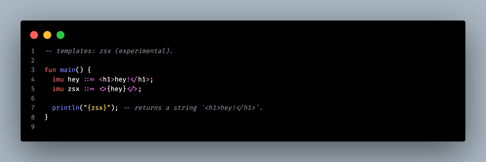
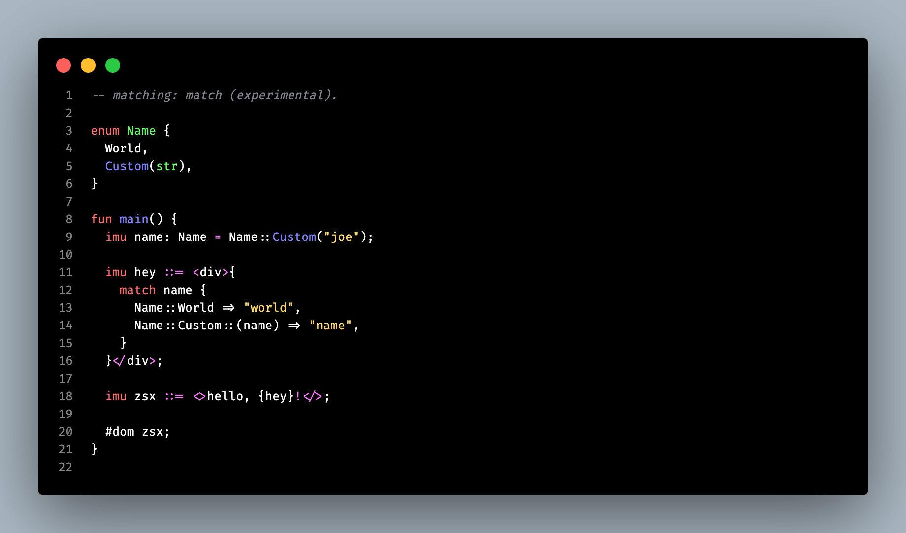

# S01E18 — 15-08-2024.

> *Le turfu du turfu.*

[prev](S01E17-14-08-2024.md) — [next](S01E19-16-08-2024.md)

## jour 18.

En rédigeant l'article d'hier sur la syntaxe, j'ai eu une ré-vé-la-tion.. Je te parlais de prendre des risques et en voici un autre que je vais rendre. Voici un nouveau panneau de signalisation de mon langage `::=`. Ce symbole va être utilisé pour faire du templating à l'instar du JavaScript standard E4X. Je t'invite à te renseigner un peu sur ce langage qui il me semble (je n'ai pas vérifié l'info) est une proposition du JavaScript.

Déjà quand tu lis la specification d'E4X, tu pète les plombs, tellement c'est un turfu sans fin ! Un TypeScript en avance sur son temps. Puis tu captes direct que E4X est le Dark Vador du JSX. Un langage quasiment parfait : un système de type, de nouveaux mots clés cohérent, un meta-langage, possibilité d'exécuter du code à la compilation ! Din-gue-rie. Mais bon, le projet a été abandonné au grand malheur du web.

Bref, si tu as parcouru un peu l'écosytème zo, tu as vu que le projet va inclure un compilateur pour le langage de programmation, un autre pour le langage de balisage ainsi qu'un dernier pour le langagage de markage. Mais grâce à ce symbol `::=` tout va changer ! Alala, je suis excité de ouf, que je n'arrive même pas à écrire et être clair. Finalement, je n'ai que deux compilateurs à écrire au lieu de trois. L'implémentation du compilateur va être plus ardus et va demander de la rigueur. Mais ça se tente. Bon ! Tu dois surement t'impatienter, donc j'me lance. Mon symbole introduit un langage de balisage au sein même du langage c-à-d que tu vas pouvoir écrire du code qui ressemble à ça :

Ma-ma-mia ! Je suis en feu lorsque je vois la syntaxe et le potentiel possible. Je suis encore en train de tester des cas, mais tu pourras avoir des bayes du type :

Tu commences à rentrer dans le délire ou pas ? Rien qu'en ajoutant ce signe, j'ai ouvert la boite de Pandore. Il m'a fallut 17 jours à ne penser qu'à ça pour parvenir à donner une dimension nouvelle à mon langage et nourir à nouveau ma motivation. Et tout ça, grâce au temps et la concentration intensive. Un truc que l'on ne nous laisse plus faire en entreprise. Généralement, il faut tout faire vite, on ne nous laisse pas le temps d'utiliser notre créativité pour apporter de vraies innovations.

Je commence à me disperser, il est l'heure de te laisser.

[@invisageable](https://twitter.com/invisageable)   

---

[prev](S01E17-14-08-2024.md) — [next](S01E19-16-08-2024.md)   
