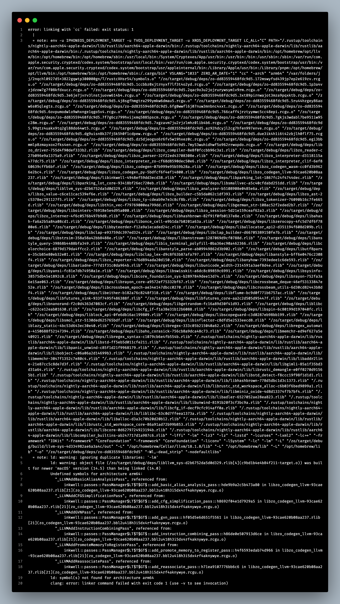

# S01E34 — 31-08-2024.

> *Les maliciels font des siennes.*

[prev](S01E33-30-08-2024.md) — [next](S01E35-01-09-2024.md)

## jour 34.

Oula, je viens d'avoir un sévère coup de chaud. Je venais de passer ma journée à nettoyer le projet, planifier, organiser, toussa toussa. Pour m'assurer que tout fonctionne correctement, j'exécute `cargo build -r`. Une commande qui va construire l'ensemble du projet. ça défile pepouz et tout d'un coup, j'ai une erreur :       

<div align="center">
    
</div>
        
> Qu'est-ce que t'as fiston ? — ... — Dis-moi où t'as mal ? — ... — Tu t'as bouffé trop de maliciels toi encore ?! Ah putain, ils attaques tout le monde ces espiogiciels.

Au vu de la longueur de l'erreur, je sens la déprime m'envahir. Je sens la pression montée, cette lopsa veut que je panique face à ce défi. Hors de question ! Je me transforme direct en dénicheur de bug. Je précise, je ne lis pas vraiment l'erreur. J'ai juste lu Inkwell et LLVM donc je sais que c'est vers là que je dois concentrer mon investigation. Par contre, ce que je ne comprends pas c'est que ce mon projet fonctionnait bien quelques minutes avant et cette erreur n'avait pas explosé. Je décide de lancer le compilateur `zo` pour savoir si cette erreur n'apparait que lors de la release ou est-ce que ça s'est propagé. ET MERDE — ça s'est propagé... j'obtiens la même erreur. sa mère la pute! Je vais niquer des mères là. J'en ai plus rien à foutre.       

Tout ceci commence à me foutre le seum, je ne comprends rien à ce qui se passe. Nor-mal hein tu m'diras. Bon, allons voir ce qu'il se passe dans le fichier `zo-codegen-llvm/codegen.rs`. Je vais mettre en silence cette partie ligne par ligne sauvegarde en relançant le programme à chaque ligne mise sous silence.         

> Erreur, encore une erreur, toujours en erreur, erreur sur toi, erreur dans ta gueule, erreur, er-reur, e...........

Je crois c'est mieux que je jete ma machine par terre en fait! Reprenons, je n'ai pas encore retirer toutes les lignes que je décide de regarder l'erreur en détail au lieu de là survoler. Et là, sur quoi je tombe ?! Le message d'erreur qui me précise clairement ce qui ne va pas :        

```
  = note: ld: warning: ignoring duplicate libraries: '-lm'
          ld: warning: object file (/zo/target/debug/deps/libllvm_sys-d2b6752da5d0d329.rlib[4](c9bd1b4e4b84f211-target.o)) was built for newer 'macOS' version (14.5) than being linked (14.0)
          Undefined symbols for architecture arm64:
            "_LLVMAddBasicAliasAnalysisPass", referenced from:
                inkwell::passes::PassManager$LT$T$GT$::add_basic_alias_analysis_pass::hde9b9a2c5b473a80 in libzo_codegen_llvm-93cae620b08aa237.rlib[21](zo_codegen_llvm-93cae620b08aa237.bbl2u418h3i5dx4rf4aknywye.rcgu.o)
            "_LLVMAddCFGSimplificationPass", referenced from:
                inkwell::passes::PassManager$LT$T$GT$::add_cfg_simplification_pass::h8692f04e1d7929a5 in libzo_codegen_llvm-93cae620b08aa237.rlib[21](zo_codegen_llvm-93cae620b08aa237.bbl2u418h3i5dx4rf4aknywye.rcgu.o)
            "_LLVMAddGVNPass", referenced from:
                inkwell::passes::PassManager$LT$T$GT$::add_gvn_pass::hf05d5e6d651f5561 in libzo_codegen_llvm-93cae620b08aa237.rlib[21](zo_codegen_llvm-93cae620b08aa237.bbl2u418h3i5dx4rf4aknywye.rcgu.o)
            "_LLVMAddInstructionCombiningPass", referenced from:
                inkwell::passes::PassManager$LT$T$GT$::add_instruction_combining_pass::h86de0e507913d6ce in libzo_codegen_llvm-93cae620b08aa237.rlib[21](zo_codegen_llvm-93cae620b08aa237.bbl2u418h3i5dx4rf4aknywye.rcgu.o)
            "_LLVMAddPromoteMemoryToRegisterPass", referenced from:
                inkwell::passes::PassManager$LT$T$GT$::add_promote_memory_to_register_pass::h4f6593edab74d966 in libzo_codegen_llvm-93cae620b08aa237.rlib[21](zo_codegen_llvm-93cae620b08aa237.bbl2u418h3i5dx4rf4aknywye.rcgu.o)
            "_LLVMAddReassociatePass", referenced from:
                inkwell::passes::PassManager$LT$T$GT$::add_reassociate_pass::h71ea9107776bb6c6 in libzo_codegen_llvm-93cae620b08aa237.rlib[21](zo_codegen_llvm-93cae620b08aa237.bbl2u418h3i5dx4rf4aknywye.rcgu.o)
          ld: symbol(s) not found for architecture arm64
          clang: error: linker command failed with exit code 1 (use -v to see invocation)
```

Je ne comprends pas encore la cause mais j'ai compris comment régler le souci dans mon programme afin que tout fonctionne à nouveau. Chacune des lignes suivantes dans l'erreur font références à des phases d'optimisations LLVM fournit par l'API Inkwell :       

```
_LLVMAddBasicAliasAnalysisPass [...] from: inkwell::passes::PassManager
_LLVMAddCFGSimplificationPass [...] from: inkwell::passes::PassManager
_LLVMAddGVNPass [...] from: inkwell::passes::PassManager
_LLVMAddInstructionCombiningPass [...] from: inkwell::passes::PassManager
_LLVMAddPromoteMemoryToRegisterPass [...] from: inkwell::passes::PassManager
_LLVMAddReassociatePass [...] from: inkwell::passes::PassManager
```

Du coup, j'ai mis sous silence toutes les passes. Et ça maaaaaaaaaaaaaaaarche ! Mon enfant n'est PLUS ma-la-de. Sacré varicelle informatique quand même. Moral de l'histoire toujours bien analyser un message d'erreur. Même si ça peut faire peur. Prendre son temps pour la comprendre surtout.      

> Ah, je suis grave content. Mes mutants commençait déjà à faire les fous. Pas le temps de niaiser avec ces maliciels.

En tout cas, LLVM cause beaucoup de souci à mon petit. Il y a trop de glue à faire, ce n'est pas facile à installer. Et pourtant c'est utiliser par la plupart des compilateurs. Le truc date de 2003 et ils n'ont toujours pas améliorer l'expérience utilisateur. Les gens s'en tamponnent grave du design. Et maintenant que l'auteur est à nouveau Papa du petit Mojo. C'est mort, il y aura sonne-per pour améliorer tout ça.      

[@invisageable](https://twitter.com/invisageable)   

---

[prev](S01E33-30-08-2024.md) — [next](S01E35-01-09-2024.md)   
