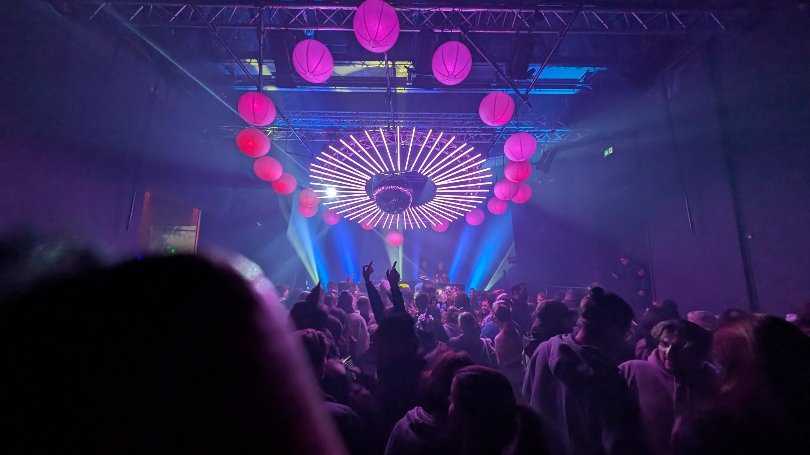

# S02E08 — 08-01-2026.

> *2.26 : hard reset.*.

[prev](S02E07-07-01-2026.md) — [next](S02E09-09-01-2026.md)

## jour 8.

J'ai eut une suite de peines qui ont plombées 2.25. Nous sommes le 31, j'suis dans un quaalude de Guadeloupe. Pour tout te dire, j'ai une envie de m'aérer l'esprit avant de pouvoir, me remettre en question pour commencer 2.26 la tête pleine d'objectifs concrêts. Avant, c'était une chose que je m'octroyais tous les deux mois, je m'organisais un voyage pour me reconnecter avec moi-même. Puis j'ai commencé à m'intéresser à l'investissement pour me garantir d'avoir une retraite confortable, du coup, j'ai mis fin à tous voyage car je voulais mettre le plus d'argent possible de côté — histoire de rattraper toutes ces années perdues.

C'est bien de penser à ça sans pour au temps oublier ce qui nous anime. Pour ma part: voyager, visiter des musées, des chateaux, faire le con, boire des cocktails et kiffer l'instant présent. Un constat lourd, mon feeling essayait de commniquer avec ma conscience, en vain, j'étais trop borné pour répondre de quoi que ce soit.

La veille du nouvel an approche, je me chauffe pour aller célébrer cela comme il se doit dans un petit endroit secret que j'ai déniché à l'arrache. 

Je ne savais pas à quoi m'attendre, mon but... en deux syllabes: kif-fer. Ce qui n'a pas manqué, J'ai passé une excellente soirée de Nouvel An. J'en ai oublié de penser à la lourdeur des derniers mois. Je me suis réveillé le lendemain avec un constat simple. Pour que 2.26 soit à la hauteur, je dois:

- Clore les dossiers du passé.
- M'accomplir sans compromis.
- Prendre mes responsabilités.

J'ai reboot mon système, je réouvre officiellement l'arc des voyages. J'ai besoin de nourrir ma créativité. Prochaine destination : Vienne. Et si vous avez des suggestions, je suis tout ouïe !

TRiLU!    

[@invisageable](https://twitter.com/invisageable)

---

[prev](S02E07-07-01-2026.md) — [next](S02E09-09-01-2026.md)
