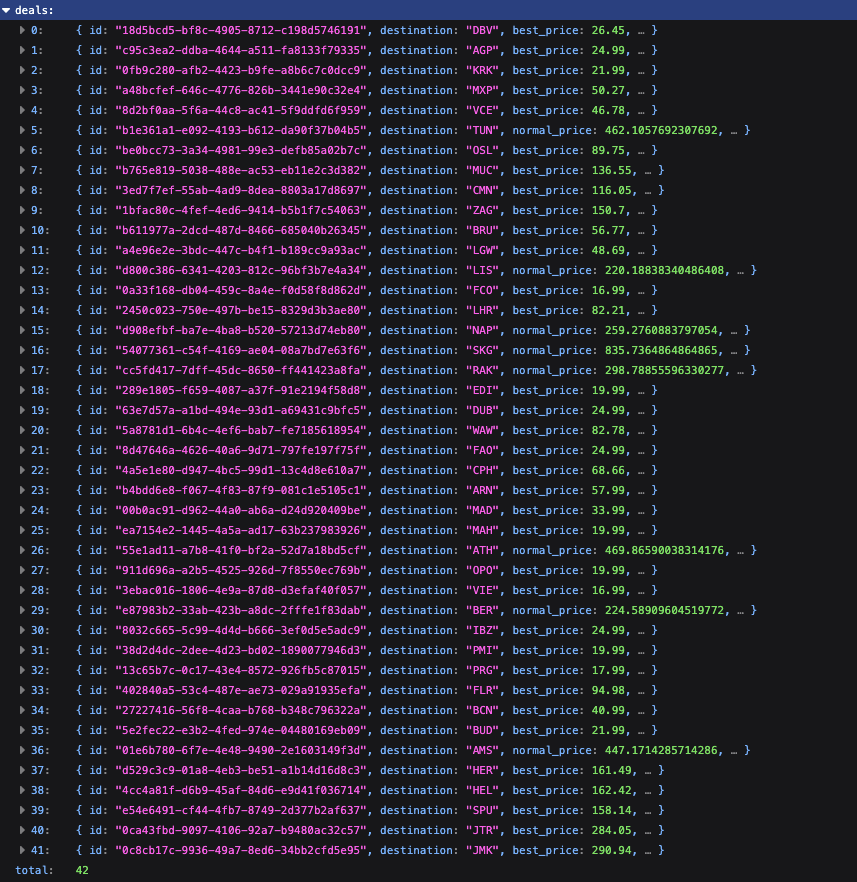

# S02E09 — 09-01-2026.

> *Le monde pour le prix d'un resto.*

[prev](S02E08-08-01-2026.md) — [next](S02E10-10-01-2026.md)

## jour 9.

Hier, toi et moi, parlions de faire le bilan, rebooter son système mais surtout de VOYAGE-voyage. Parce qu'avec un objectif d'un voyage par mois, il va falloir être malin et chiner les meilleurs offres sur tous les terrains. C'est là qu'entre en jeu la beauté fonctionnelle d'être un développeur puisque, dès que tu as une idée, tu peux la développer. Tout n'est qu'une question de volonté et de motivation et comme la je suis ultra chaud pour ma quête de voyage. Je me suis créer un petit tracker de billets d'avions du turfu. Dès que je dois préparer un trip, je lance mon tracker, il me balance une liste en fonction de l'aéroport le plus proche et c'est parti pour les réservation. Plus besoin de passer des heures à chercher, non non, ça c'est fini. Un bon flemmard, il optimise son temps en déléguant des tâches qui peuvent être automatisées.    

C'est assez incroyable, comme tu peux le voir, je peux aller à PRG (Prague) pour 17.99 €, ARN (Stockholm) pour 57.99 €, VIE (Vienne) pour 16.99 €, BUD (Budapest) pour 21.99 €, MIA (Miami) pour 370.92 € ou encore JFK (New York) pour 393.93 €. Au temps te dire que ça fonctionne pas trop mal comme programme.    

Je vais transformer toutes ces données en une application pour recevoir des notifications en tant réel, l'idée c'est de pouvoir agir rapidement dès qu'une offre intéressante se présente. Bien sûr, une fois que j'ai testé mon app et que je vois que ça fonctionne bien, je te ferai tourner tout ça que tu puisses toi aussi en profiter et voir le monde sous un angle différent.    

> « J'entrevois déjà le potentiel de cette idée. »

TRiLU!    

[@invisageable](https://twitter.com/invisageable)

---

[prev](S02E08-08-01-2026.md) — [next](S02E10-10-01-2026.md)
