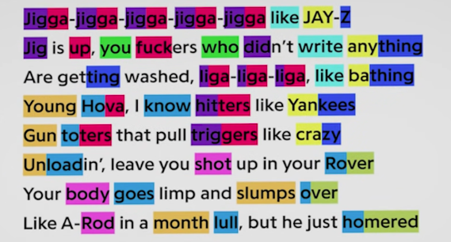
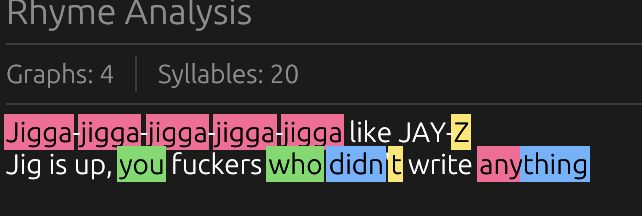
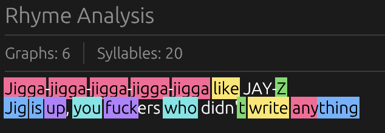

# S02E16 — 16-01-2026.

> *raplord*.

[prev](S02E14-14-01-2026.md) — [next](S02E17-17-01-2026.md)

## jour 16.

En cherchant à résoudre un probléme que j'avais dans l'écriture de texte. Je voulais me créer un petit programme capable de détecter les rimes dans un texte et de lié les rimes entre elles. C'est un concept vachement inspiré par Rap Genius notamment avec celle d'Eminem.



Techniquement, pour réaliser ça, il faut un pipeline similaire à celui d'un compilateur ? D'abord on doit pouvoir détecter les tokens, en français les jetons. Dis-toi qu'un jeton est l'équivalent d'un moment. Ensuite à partir de ces moments nous devons transformer chaque mots sous sa forme phonétique. Par exemple, si mon vers est:

`bonjour mon amour` devient `bɔ̃ʒuʁ mɔ̃n amuʁ`

Première étape, je récole mes jetons:

```rust
pub struct Token {
  kind: TokenKind,
}

[
  Token {
    kind: TokenKind::Word("bonjour")
  },
  Token {
    kind: TokenKind::Word("mon")
  },
  Token {
    kind: TokenKind::Word("amour")
  },
]
```

Seconde étape, la phonétique, les fameux phonèmes.

```rust
pub struct Word {
  token: Token,
  phonemes: Vec<Phoneme>,
}

[
  Workd {
    token: Token {
      kind: TokenKind::Word("bonjour")
    },
    phonemes: vec![Phoneme("bɔ̃"), Phoneme("ʒuʁ")],
  },
  Workd {
    token: Token {
      kind: TokenKind::Word("bonjour")
    }
    phonemes: vec![Phoneme("mɔ̃n")],
  },
  Workd {
    token: Token {
      kind: TokenKind::Word("bonjour")
    }
    phonemes: vec![Phoneme("a"), Phoneme("muʁ")],
  },
]
```

Comme tu le vois, je découpe les phonmèmes par syllabes. Ce qui veut dire qu'il faut un système pour le faire pour nous. Ca tombe bien il y a une librairie en python qui peut faire ça pour nous. Pourquoi, je veux absolument découper par syllabes c'est que pour l'étape suivante, j'aimerai pouvoir créer un graqhe  par groupe de rimes. Par exemple `bon` et `mon` doit faire parti du même graphe et `jour`, `mour` constituerai un autre groupe. 

Je sais qu'ensuite, je serai capable de pouvoir mettre en lumière les rimes. Donc ça c'est comment je voyais l'approche. Et vois le premier résultat.



Bon ça ne marche pas bien, mais le concept est là. Mon programme est capable de détecter les mots, ensuite de définir les phonèmes par syllabes et de créer un graphe. `you` and `who` fonctionnent donc, pas si zboone que ça le monsieur. Après avoir améliorer un peu plus les différents étapes de mon tuyau. Le résultat s'améliore:



Comme tu le constates, maintenant mon programme détecte un peu mieux les groupes de rimes, `up` et `fuck` sont de la même couleur. `write`, `like` forme un groupe d'une autre couleur et `you` et `who` aussi. 

> Maintenant que je sais mapper les rimes, je vais pouvoir mapper mon futur sans aucune fausse note.

TRiLU!

[@invisageable](https://twitter.com/invisageable)

---

[prev](S02E14-14-01-2026.md) — [next](S02E17-17-01-2026.md)
