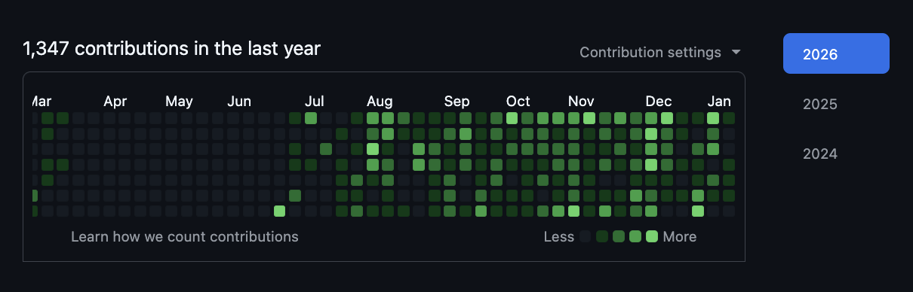

# S02E18 — 18-01-2026.

> *github est de mèche !*

[prev](S02E17-17-01-2026.md) — [next](S02E19-19-01-2026.md)

## jour 18.

Ce graphique représente mes contributions entre 2.25 et 2.26 sur github. C'est quoi une contribution ? Viteuf comme ça, si on faisait un parallèle avec le jeu vidéo, une contribution peut être vu comme une sauvegarde dans un jeu vidéo. Sur notre graphique plus le vert est intensif, plus il y a eut de sauvegardes. C'est une vulgarisation simple mais des nuances sont possibles. Pour l'instant ce n'est pas important de les détailler. 

Pour en revenir au graphique, chaque carré représente un jour, avec les mois sur l'axe des abscisses, tu peux clairement identifier les colonnes pour chaque mois. Donc finalement, Github connait exactement le nombre de sauvegardes que l'on fait part jour, tout au long de l'année. A quoi peut bien leur servir toutes ces données ?

Parce que bon quand c'est gratuit, c'est que c'est toi le produit. Ils doivent surement vendre ces données à quelqu'un sans parler du code que l'on rend public. C'est fort possible que malgré les LICENSE notre code soit utilisé pour donner à manger aux intelligences artificielles. C'est quasiment sûr. Ça ouvre des portes sur le futur remplaçant de github. Un endroit dans lequel tout ceci sera éviter.

Il faut vraiment un système ou chacun décide du code qu'il souhaite partager et rendre la tâche difficile aux robots iA de venir se servir.

> « la propriété est un jardin secret qui doit être préserver. »

TRiLU!

[@invisageable](https://twitter.com/invisageable)

---

[prev](S02E17-17-01-2026.md) — [next](S02E19-19-01-2026.md)
